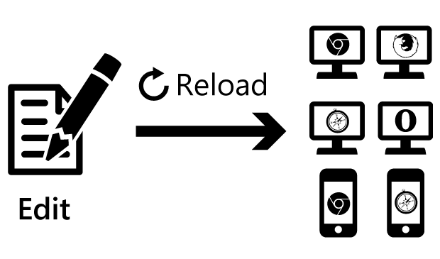
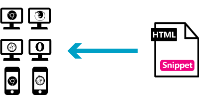
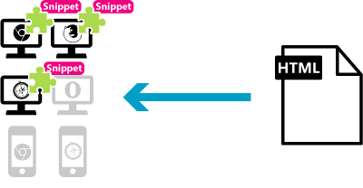

# LiveReloadX



Edit files, and browsers are reloaded automatically.

_LiveReloadX_ is an implementation of the [LiveReload 2.X](http://livereload.com/) in Node.js.

* Easy to install
* Easy to run (Completely free of charge)
* Simple and readable source code


## How does this work?


  1. Type `livereloadx path/to/dir` on your command line, then LiveReloadX starts:
     * monitoring `path/to/dir`
     * running as a web server on port `35729` which serves `livereload.js` and acts as a WebSocket server.
  2. When a browser load `livereload.js`, it connects to the LiveReloadX server using WebSocket.
  3. If you modify files under `path/to/dir`, the server tells all clients to reload by themselves.

If you're not familliar with a command line interface, we recommend the [official version of LiveReload 2](http://livereload.com/) which has GUI,


## Install

1. Download and install [Node.js](http://nodejs.org/)
2. Run `npm -g install livereloadx`
3. Choose how to embed JavaScript snippet (see the next section for details)


## Embed JavaScript snippet

You have to embed the JavaScript snippet in HTML pages to enable live reloading.

Choose one of the following methods to embed the JavaScript snippet.

   * Add the JavaScript snippet manually.
   * Install the [browser extensions](http://feedback.livereload.com/knowledgebase/articles/86242-how-do-i-install-and-use-the-browser-extensions-) (Safari, Chrome and Firefox only).
   * Use static mode
   * Use proxy mode


### Add the JavaScript snippet manually



Add the following snippet to your HTML files. If you use an HTML template framework, add to HTML template files.

```html
<script>document.write('<script src="http://' + (location.host || 'localhost').split(':')[0] +
':35729/livereload.js?snipver=2"></' + 'script>')</script>
```

### Install the browser extensions



Install the browser extensions from [How do I install and use the browser extensions? – LiveReload Help & Support](http://feedback.livereload.com/knowledgebase/articles/86242-how-do-i-install-and-use-the-browser-extensions-). Safari, Chrome and Firefox on PC is supported.

Enable these extensions  by clicking the LiveReload toolbar button, then the JavaScript snippet is automatically added to the current page.


### Use static mode


If your site is static (not generated dynamically), this method would be useful.

In order to enable static mode, run with `-s` or `--static` option.

```bash
$ livereloadx -s [-p 35729] [path/to/dir]
```

In static mode, LiveReloadX works as a **static web server** whose document root is `path/to/dir`. An access to `http://localhost:35729/foo/` refers to `path/to/dir/foo/index.html`. What's more, LiveReloadX automatically adds the JavaScript snippet to an HTML document.


### Use proxy mode


If you don't want to edit HTML and install the browser extension and your site is dynamic, this option would be useful.

In order to enable proxy mode, run with `-y http://example.com/` or `--proxy http://example.com/` option.

```
$ livereloadx -y http://example.com/ [-p 35729] [-l] [path/to/dir]
```

In proxy mode, LiveReloadX works as a **reverse proxy server** that retrieves resources from `http://example.com/`. For example, an access to `http://localhost:35729/foo/` are forwarded to `http://example.com/foo/`, and then, the resources are returned to the client. What's more, LiveReloadX automatically adds the JavaScript snippet to an HTML document.

If `-l` or `--prefer-local` flag is enabled, LiveReloadX prefers local files to remote resources. For example, when LiveReloadX get an access to `http://localhost:35729/foo/`, it first checks `path/to/dir/foo/index.html`. If it exists, LiveReloadX returns its content, otherwise, LiveReloadX retrieves the content from `http://example.com/foo/`.


## Usage

```
$ livereloadx [-s | -y] [-l] [-p 35927]  [path/to/dir]

  Usage: livereloadx [options] [dir]

  Options:

    -h, --help          output usage information
    -V, --version       output the version number
    -p, --port <port>   change wait port
    -l, --prefer-local  return a local file if it exists (proxy mode only)
    -s, --static        enable static server mode
    -v, --verbose       enable verbose log
    -y, --proxy <url>   enable proxy server mode
    -C, --no-liveCSS    disable liveCSS
    -I, --no-liveImg    disable liveImg
```


License
-------

This code is released under the MIT license.